# Amazon Timestream Driver for Java
This package provides a JDBC driver to Amazon Timestream for Java.

# User Documentation

## Prerequisites
1. **Sign up for AWS** &mdash; Before beginning, have an AWS account. For more information about creating an AWS 
account and retrieving your AWS credentials, see [Sign Up for AWS and Create an IAM User](https://docs.aws.amazon.com/sdk-for-java/v1/developer-guide/signup-create-iam-user.html) in the AWS SDK for Java 
Developer Guide.
1. **Minimum requirements** &mdash; To use the Amazon Timestream JDBC driver  for Java, **Java 1.8+** is required.

## Using the Timestream JDBC driver
The Timestream JDBC driver is distributed as two JAR files.

### JAR With All Dependencies Shaded Except SLF4J (amazon-timestream-jdbc-\<version\>-jar-with-all-dependencies.jar)
This is the shaded JAR which bundles up all the required dependencies and can be used directly in Java projects and external applications, without explicitly adding external dependencies. This JAR does not relocate the classpath of SLF4J, allowing logging to be enabled in external applications.

###  Driver Setup in BI Applications
The JDBC driver is compatible with a number of BI tools. Instructions are outlined here for:

- [Aqua Data Studio](markdown/setup/aqua-data-studio-setup.md)
- [DBeaver](markdown/setup/dbeaver-driver-setup.md)
- [DbVisualizer](markdown/setup/dbvisualizer-driver-setup.md)
- [SQuirreL](markdown/setup/squirrel-driver-setup.md)
- [Tableau Desktop](markdown/setup/tableau-desktop-driver-setup.md)

For other BI tools, please refer to that tool's product documentation

### JAR With No Dependencies (amazon-timestream-jdbc-\<version\>.jar)
This is the lightweight JAR which does not include any dependencies. This JAR could be used if the application developer does not want duplicate dependencies and want full control over their dependency tree.

## Driver Class
Some database connection tools require specifying the class name.
The driver class for Timestream JDBC driver is: 
```JAVA
software.amazon.timestream.jdbc.TimestreamDriver
```

## Creating a Connection
To create a connection, construct a connection URL by appending optional connection properties to the default Timestream URL `jdbc:timestream`. The URL could be directly constructed, or a `Properties` object could be used in a Java application to do so.

The default URL for Timestream is `jdbc:timestream`.

### Constructing the Connection URL
Timestream supports optional connection properties that could be specified through the JDBC URL. To specify these optional properties use the following URL format: `jdbc:timestream://PropertyName1=value1;PropertyName2=value2...`. Note the property name is **case sensitive**.

An example of the JDBC URL with properties: `jdbc:timestream://AccessKeyId=myAccessKeyId;SecretAccessKey=mySecretAccessKey;SessionToken=mySessionToken;Region=myRegion`

### Using a `Properties` Object to Specify Connection Properties
A `Properties` object could be used to construct a connection URL in a Java application.

```Java
Properties prop = new Properties();
prop.put("AccessKeyId", "myAccessKeyId");
prop.put("SecretAccessKey", "mySecretAccessKey");
prop.put("SessionToken", "mySessionToken");
prop.put("Region", "myRegion");

DriverManager.getConnection(URL, prop);
```

If the same connection properties are specified in both the URL and the `Properties` instance, the connection property in the URL will take precedence. For instance, in the following example "foo" will be used during authentication:
```Java
final String url = "jdbc:timestream://AccessKeyId=foo";
final Properties prop = new Properties();
prop.put("AccessKeyId", "userName");
 
DriverManager.getConnection(url, prop);
``` 

### Optional Connection Properties

>**NOTE:** All property keys are *case-sensitive*.

All the connection properties are optional. If none of these properties are provided in the url `jdbc:timestream`, the Timestream JDBC driver will use the [AWS default credentials chain](https://docs.aws.amazon.com/sdk-for-java/v1/developer-guide/credentials.html) to load the credentials.

#### Standard Client Info Option
| Option | Description | Default |
|--------|-------------|---------------|
| `ApplicationName` |  The name of the application currently utilizing the connection.  This name is used for users' own debugging purposes and will not be communicated to the Timestream service. | The application name detected by the driver.  |

#### Driver Configuration Option

| Option | Description | Default |
|--------|-------------|---------------|
| `EnableMetaDataPreparedStatement` | Enables Timestream JDBC driver to return metadata for PreparedStatements, but this will incur an additional cost with Timestream when retrieving the metadata. | `false` |

#### SDK Options

| Option | Description | Default |
|--------|-------------|---------------|
| `RequestTimeout` | The time in milliseconds the AWS SDK will wait for a query request before timing out. Non-positive value disables request timeout. | `0`
| `SocketTimeout` | The time in milliseconds the AWS SDK will wait for data to be transferred over an open connection before timing out. Value must be non-negative. A value of 0 disables socket timeout.| `50000`
| `MaxRetryCountClient` | The maximum number of retry attempts for retryable errors with 5XX error codes in the SDK. The value must be non-negative.| `NONE`
| `MaxConnections` | The maximum number of allowed concurrently opened HTTP connections to the Timestream service. The value must be positive.| `50`

#### Endpoint Configuration Options

| Option | Description | Default |
|--------|-------------|---------------|
| `Endpoint` | The endpoint for the Timestream service. | `NONE`
| `Region` | The signing region for the Timestream service endpoint. The signing region can be specified without an endpoint, but must be specified if a custom endpoint is given.| `NONE` |

#### Basic Authentication Options

| Option | Description | Default |
|--------|-------------|---------------|
| `AccessKeyId` | The AWS user access key id. | `NONE` |
| `SecretAccessKey` | The AWS user secret access key. | `NONE` |
| `SessionToken` | The temporary session token required to access a database with multi-factor authentication (MFA) enabled. | `NONE` |

#### Credentials Provider Options

| Option | Description | Default |
|--------|-------------|---------------|
| `AwsCredentialsProviderClass` | One of `PropertiesFileCredentialsProvider` or `InstanceProfileCredentialsProvider` to use for authentication. | `NONE`
| `CustomCredentialsFilePath` | The path to a properties file containing AWS security credentials `accessKey` and`secretKey`. This is only required if `AwsCredentialsProviderClass` is specified as `PropertiesFileCredentialsProvider`.| `NONE` |

#### SAML-Based Authentication Options for Okta

| Option | Description | Default |
|--------|-------------|---------------|
| `IdpName` | The Identity Provider (IdP) name to use for SAML-based authentication. One of `Okta` or `AzureAD`. | `NONE`
| `IdpHost` | The hostname of the specified IdP. | `NONE`
| `IdpUserName` | The user name for the specified IdP account. | `NONE`
| `IdpPassword` | The password for the specified IdP account. | `NONE`
| `OktaApplicationID` | The unique Okta-provided ID associated with the Timestream application. A place to find the AppId is in the entityID field provided in the application metadata. An example entityID=`"http://www.okta.com//<IdpAppID>"`| `NONE`
| `RoleARN` | The Amazon Resource Name (ARN) of the role that the caller is assuming. | `NONE`
| `IdpARN` | The Amazon Resource Name (ARN) of the SAML provider in IAM that describes the IdP. | `NONE`

#### SAML-Based Authentication Options for Azure Active Directory

| Option | Description | Default |
|--------|-------------|---------------|
| `IdpName` | The Identity Provider (IdP) name to use for SAML-based authentication. One of `Okta` or `AzureAD` | `NONE`
| `IdpUserName` | The user name for the specified IdP account. | `NONE`
| `IdpPassword` | The password for the specified IdP account. | `NONE`
| `AADApplicationID` | The unique id of the registered application on Azure AD. | `NONE`
| `AADClientSecret` | The client secret associated with the registered application on Azure AD used to authorize fetching tokens. | `NONE`
| `AADTenant` | The Azure AD Tenant ID. | `NONE`
| `IdpARN` | The Amazon Resource Name (ARN) of the SAML provider in IAM that describes the IdP. | `NONE`

### SAML-Based Authentication Configuration
Timestream supports SAML-based authentication using both Okta and Azure Active Directory.

#### Configure SAML 2.0 for AWS with Okta.

##### Prerequisites
1. Admin permissions in AWS to create the identity provider and the roles.

1. An Okta account: [https://www.okta.com/login/](https://www.okta.com/login/).

1. Access to Timestream.

1. Creating the AWS Account Federation application on Okta.

1. Set up SAML for Okta.

1. Configure Timestream JDBC driver to use Okta to access Timestream.

##### Creating AWS Account Federation on Okta
1. Sign in to the Okta Admin dashboard: `https://<company domain name>-admin.okta.com/admin/apps/active`.

1. Select `Add Application` and search for `AWS Account Federation`.  
    
    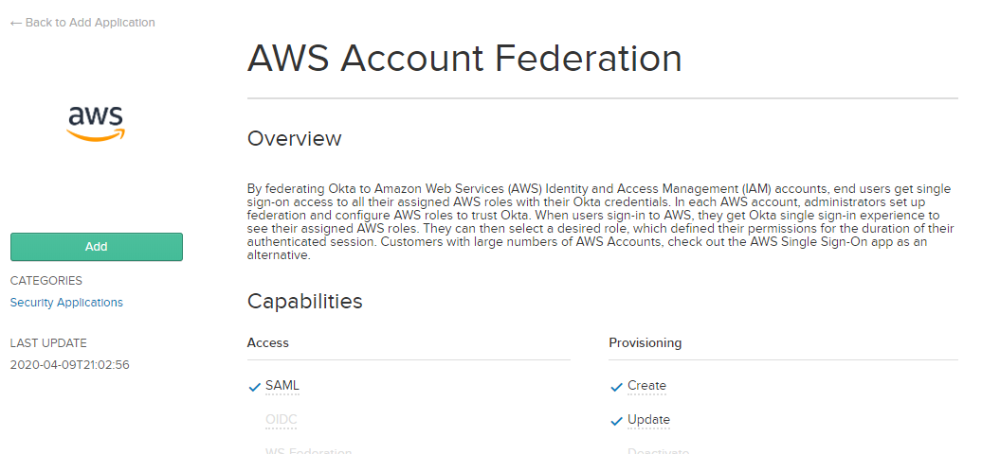
1. Click `Add`.

1. Change the Login URL to the appropriate URL, e.g. `https://console.aws.amazon.com/console/home?region=us-east-1`.  
    
    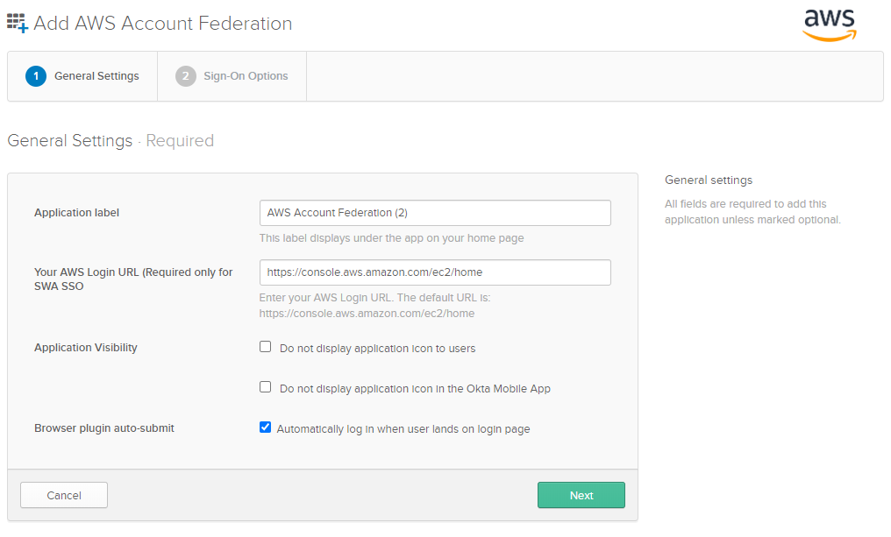
1. Click `Next`.

1. Select `SAML 2.0` As the Sign-On method.  
    
    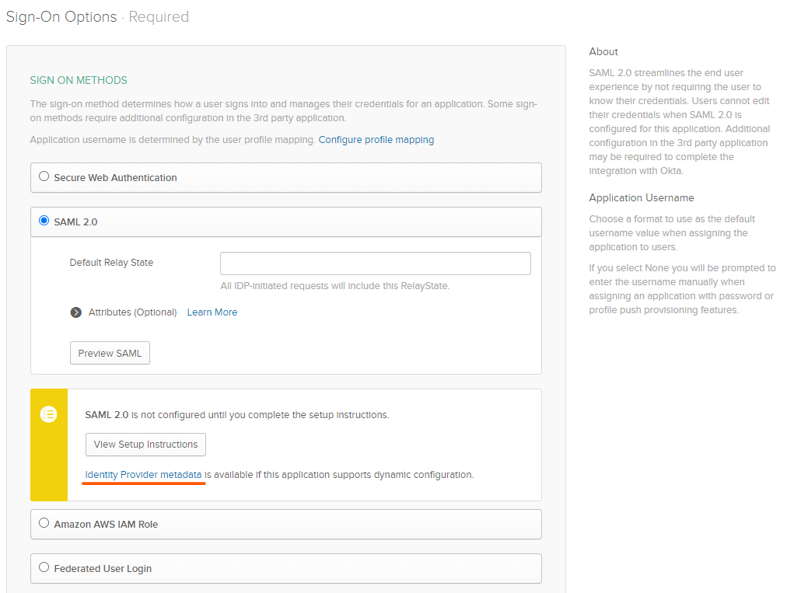
1. Click `Identity Provider metadata` to open the metadata XML file. Save the file locally, this is required later when creating the Okta identity provider.

1. Leave the other configuration as blank for now.

1. Click `Done`.

##### Setting up Okta for SAML
Select the Sign On tab. Click the `View Setup Instructions` button in the `Settings` section to set up SAML with Okta.

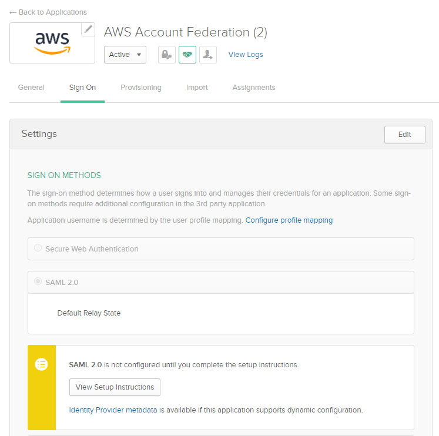

Alternatively use the following link to view the setup instruction:

[https://saml-doc.okta.com/SAML_Docs/How-to-Configure-SAML-2.0-for-Amazon-Web-Service.html](https://saml-doc.okta.com/SAML_Docs/How-to-Configure-SAML-2.0-for-Amazon-Web-Service.html)

The difference between these two links is that the latter link does not provide the link to the Metadata Document required when creating the Okta IdP.

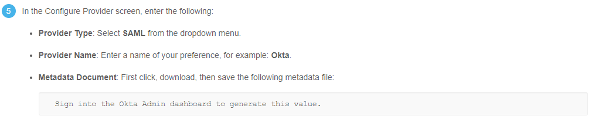

This document could be found at:
1. `https://<company domain name>-admin.okta.com/admin/apps/active`.

1. Select the AWS Account Federation application.

1. Select the Sign On tab.

1. Click on the `Identity Provider metadata` hyperlink under the `View Setup Instruction` button to be redirected to the XML file.


#### Configure SAML 2.0 for AWS with Azure Active Directory.

##### Prerequisites
1. Admin permissions in AWS to create the identity provider and the roles.

1. An Azure Active Directory account: [https://azure.microsoft.com/en-ca/services/active-directory/](https://azure.microsoft.com/en-ca/services/active-directory/)

1. Access to Timestream.

1. Setting up the Azure enterprise non-gallery application using single sign-on (SSO) with SAML.

1. Setting up the IAM provider and roles:
        
    - Creating the SAML identity provider.
        
    - Creating an IAM role for access to Timestream.
        
    - Creating an IAM policy allowing the IAM role to generate an AWS STS token to connect to Timestream.

1. Start provisioning for Azure AD access to the newly created IAM IdP and Roles.

1. Configure Timestream JDBC driver to use Azure AD to access Timestream.

##### Setting up Azure AD
1. Sign in to [Azure Portal](https://portal.azure.com/#home).

1. Select `Azure Active Directory` in the list of Azure services, this will redirect to the `Default Directory` page.

1. Select `Enterprise Applications` under the `Manage` section on the sidebar:  
    
    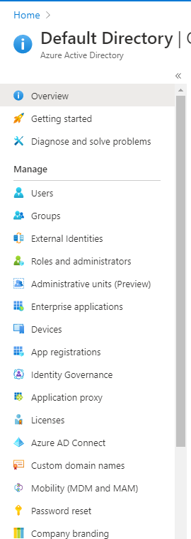
1. Select `+ New application` 

1. Find and select `Amazon Web Services`  
    
    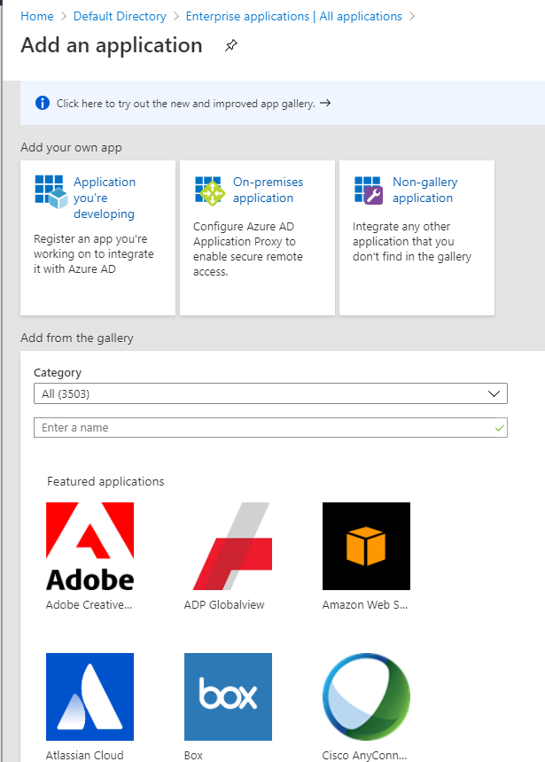
1. Select `Single sign-on` under `Manage` section in the sidebar:  
    
    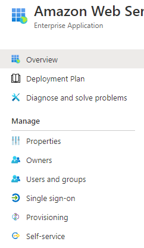
1. Choose SAML as the single sign-on method.

1. In the `Basic SAML Configuration`, enter `https://signin.aws.amazon.com/saml` for both the `Identifier` and the `Reply URL`:  
    
    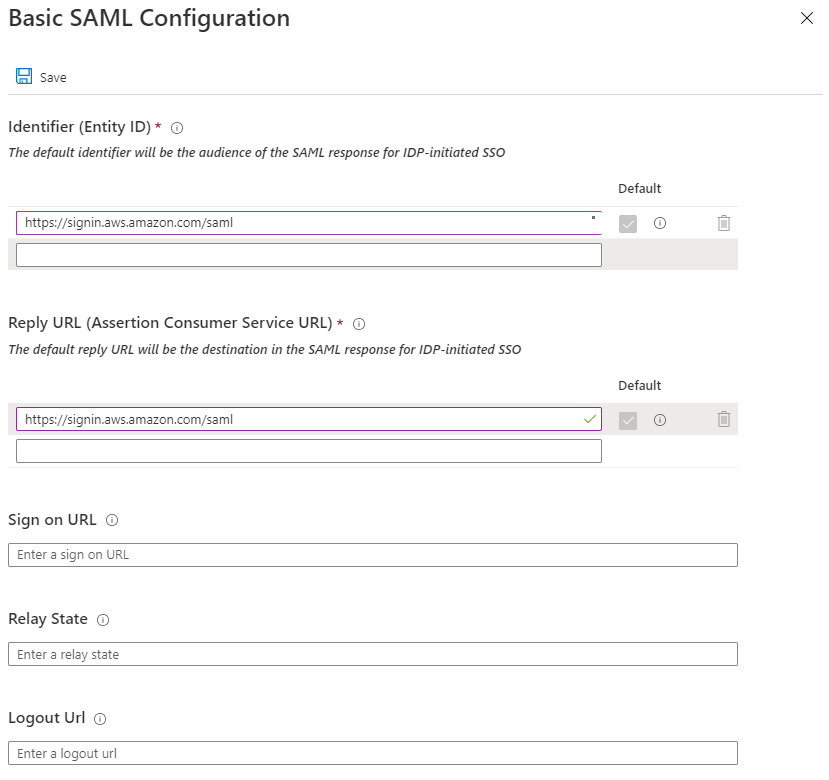
1. Click `Save`.

1. Download the `Federation Metadata XML` in the `SAML Signing Certificate` section. This will be used when creating the IAM Identity Provider later.  
    
    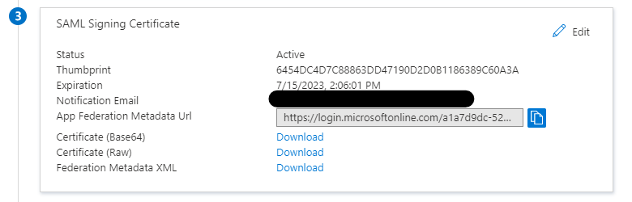
1. Go back to the `Default Directory` page, select `App registrations` under `Manage`.  
    
    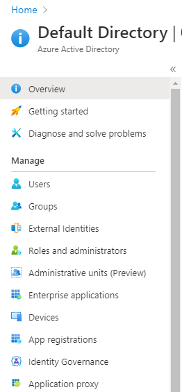
1. Select `Timestream` from the `All Applications` section, the page will be redirected to the application’s `Overview` page.

1. Take notes of the `Application (client) ID` and the `Directory (tenant) ID`, these values are required for when creating a connection:  
    
    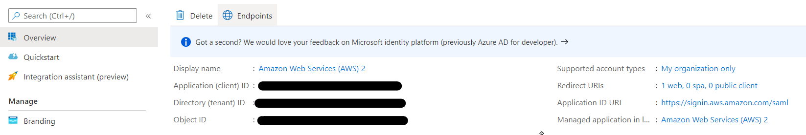
1. Select `Certificates & secrets`  
    
    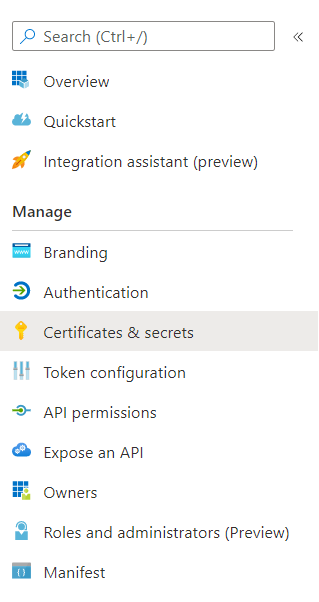
1. Under `Client secrets`, create a new client secret with `+ New client secret`. Take note of the generated value, this is required when creating a connection to Timestream.

1. On the sidebar under `Manage`, select `API permissions`.

1. In the `Configured permissions`, use `Add a permission` to grant Azure AD permission to sign in to Timestream. Select `Microsoft Graph` on the `Request API permissions` page.   
    
    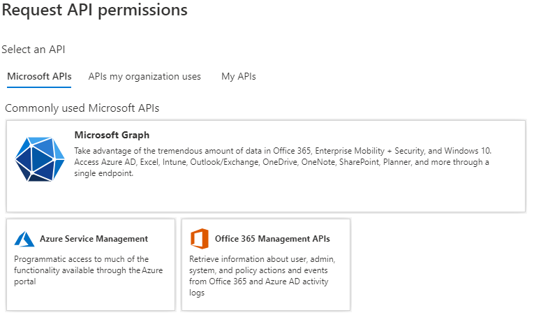
1. Select `Delegated permissions`, select the `User.Read` permission.  
    
    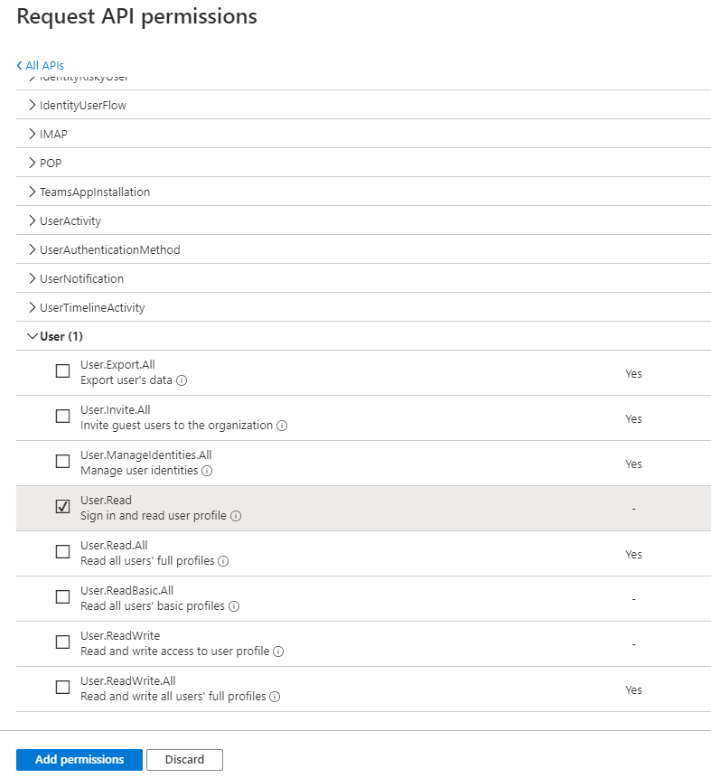
    
    Click `Add permissions`.

1. Click `Grant admin consent for Default Directory`.  
    
    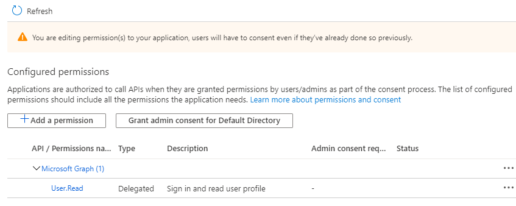

Azure AD set up process is now complete.
##### Setting up IAM Identity Provider and Roles in AWS
This set up goes through the following:
1. Creating the SAML identity provider.

1. Creating an IAM role for access to Timestream.

1. Creating an IAM policy allowing the IAM role to generate an AWS STS token to connect to Timestream.

##### Create a SAML Identity Provider
1. Sign in to the [AWS Management Console](http://aws.amazon.com/console).

1. Select `Services` and select `IAM` under `Security, Identity, & Compliance`.

1. Select `Identity providers` under `Access management`.  
    
    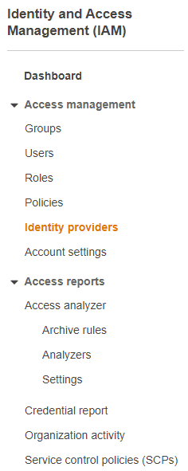
1. Select `Create Provider` and choose `SAML` as the provider type. Enter the Provider Name, this example will use AzureADProvider.

1. Upload the previously downloaded Federation Metadata XML file.  
    
    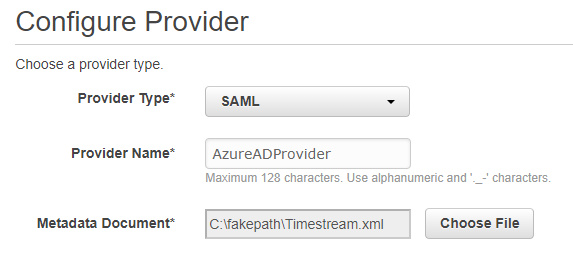
1. Select `Next` then `Create`.

Upon completion, the page will be redirected back to the `Identity providers` page.
##### Create an IAM role
1. On the sidebar select `Roles` under `Access management`.

1. Select `Create role`.

1. Choose `SAML 2.0 federation` as the trusted entity.

1. Choose the Azure AD provider.

1. Select `Allow programmatic and AWS Management Console access`.
    
    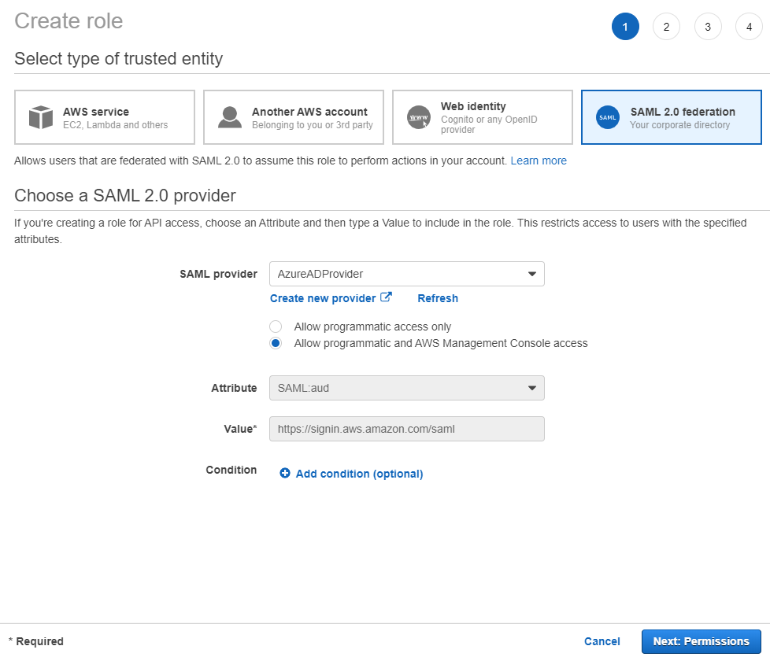
1. Click `Next: Permissions`

1. Attach permissions policies or continue to `Next:Tags`.

1. Add optional tags or continue to `Next:Review`

1. Enter a `Role name`, this example will use `AzureSAMLRole`.

1. Provide a role description.

1. Click `Create Role` to complete.

##### Create an IAM Policy
1. On the sidebar select `Policies` under `Access management`.

1. Select `Create policy` and select the `JSON` tab.

1. Add the following policy:
    ```json
    {
        "Version": "2012-10-17",
        "Statement": [
            {
                "Effect": "Allow",
                "Action": [
                    "iam:ListRoles",
                    "iam:ListAccountAliases"
                ],
                "Resource": "*"
            }
        ]
    }
    ```
1. Select `Create policy`.

1. Enter a policy name, this example will use `TimestreamAccessPolicy`

1. Select `Create Policy`.

1. On the sidebar select `Roles` under `Access management`. Select the previously created Azure AD role, select `Attach policies` under `Permissions`.
    
    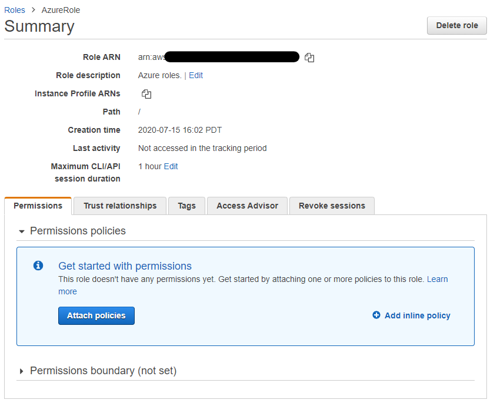
1. Select the previously created access policy.

##### Provisioning
1. Go back to Azure Portal. 

1. Select `Azure Active Directory` in the list of Azure services, this will redirect to the `Default Directory` page.

1. Select `Enterprise Applications` under the `Manage` section on the sidebar.

1. Select `Provisioning`

1. Select `Automatic mode` for the `Provisioning Method`.

1. Under Admin Credentials, enter `AwsAccessKeyID` for `clientsecret`, and `SecretAccessKey` for `Secret Token`.

1. Set the `Provisioning Status`to `On`.  
    
    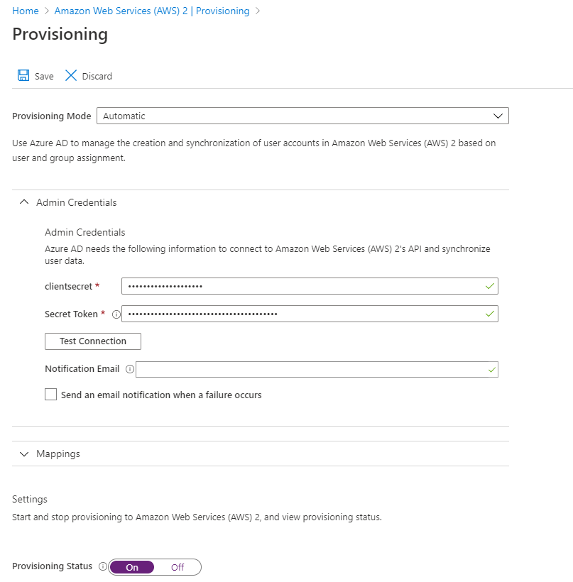
1. Click save. This allows Azure AD to load the necessary IAM Roles.

1. Once the `Current cycle status` is completed, select `Users and groups` on the sidebar.  
    
    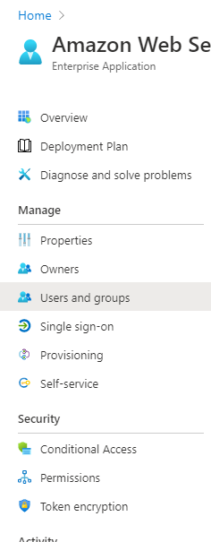
1. Select `+ Add user`.

1. Select the Azure AD user to provide access to Timestream.

1. Select the IAM Azure AD role and the corresponding Azure Identity Provider created in AWS.  
    
    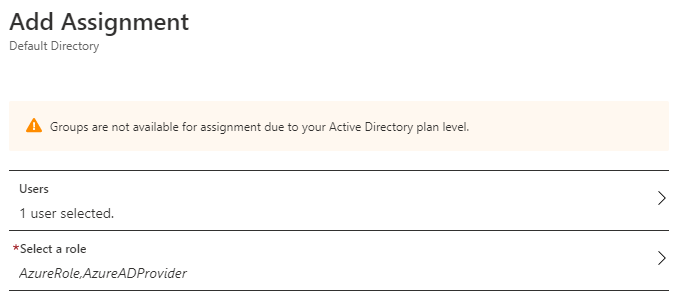
1. Select Assign.

# Developer Documentation

## Building the driver

### Building the fully shaded JAR With All Dependencies Shaded Except SLF4J (amazon-timestream-jdbc-\<version\>-jar-with-all-dependencies.jar)
To build a fully shaded JAR, comment out the following two lines in the pom file in the [/jdbc/pom.xml](/jdbc/pom.xml) then run `mvn install`.

```xml
<scope>system</scope>
<systemPath>${project.basedir}/resources/aws-sdk-java-timestreamquery-1.11.805-SNAPSHOT.jar</systemPath>
```
Since the Timestream Query SDK is not yet available on Maven Repository, these two lines are included to ensure that Github Actions can build the project.

### Building and using the JAR with no dependencies (amazon-timestream-jdbc-\<version\>.jar)
To build the JAR with no dependencies, run `mvn install`. 

To use the JAR with no dependencies in a Java application, the following required dependencies need to be added inside the pom file of your project.

```xml
<dependencies>
    <dependency>
        <groupId>com.amazonaws</groupId>
        <artifactId>aws-java-sdk-core</artifactId>
        <version>1.11.804</version>
    </dependency>
    <dependency>
        <groupId>com.amazonaws</groupId>
        <artifactId>aws-java-sdk-sts</artifactId>
        <version>1.11.804</version>
    </dependency>
      <dependency>
        <groupId>com.amazonaws</groupId>
        <artifactId>timestreamquery</artifactId>
        <version>1.11.805-SNAPSHOT</version>
      </dependency>
      <dependency>
        <groupId>com.amazonaws</groupId>
        <artifactId>timestreamwrite</artifactId>
        <version>1.11.805-SNAPSHOT</version>
      </dependency>
    <dependency>
        <groupId>com.google.guava</groupId>
        <artifactId>guava</artifactId>
        <version>28.0-jre</version>
    </dependency>
    <dependency>
        <groupId>org.jsoup</groupId>
        <artifactId>jsoup</artifactId>
        <version>1.13.1</version>
    </dependency>
    <dependency>
        <groupId>org.slf4j</groupId>
        <artifactId>jul-to-slf4j</artifactId>
        <version>1.7.24</version>
    </dependency>
</dependencies>
```

### Building and using the Javadoc JAR to extract the Javadoc HTML files (amazon-timestream-jdbc-\<version\>-javadoc.jar)
Javadoc JAR builds with `mvn install` alongside the other JAR files. To extract the Javadoc HTML files, use the following command: `jar -xvf amazon-timestream-jdbc-1.0.0-javadoc.jar`

### Known Issues
1. Timestream does not support fully qualified table names.
2. Timestream does not support the queries that contain ":" in the column aliases. Tools like Tableau may not work as expected.

### Caveats
1. Timestream JDBC driver supports `getSchemas` and does not support `getCatalogs`, so Tableau will show database as schemas instead of catalogs. 
2. SQuirreL SQL Client does not support Rows and Arrays. Running a `SELECT` query that returns an Array or a Struct will result in `UnknownType<2,003>`/`UnknownType<2,002>`.
3. SQLWorkbench/J does not support using `Database Explorer` to describe Timestream databases with an `underscore` in the name, e.g. `grafana_db`.
4. SQLWorkbench/J does not display the array values within a `java.sql.Struct`, instead SQLWorkbench/J displays the array's base type, e.g.`com.tsshaded.amazonaws.services.timestreamquery.model.Row(DOUBLE, 2)` instead of `({1.3},2)`.

## License
This library is licensed under the Apache 2.0 License.
