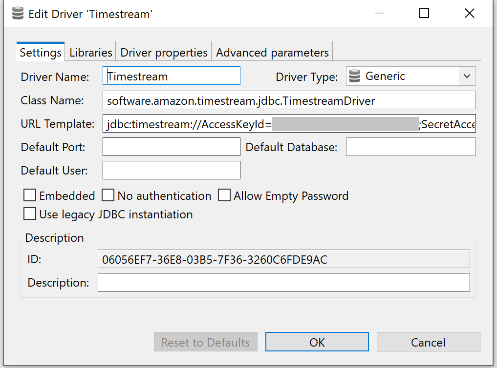
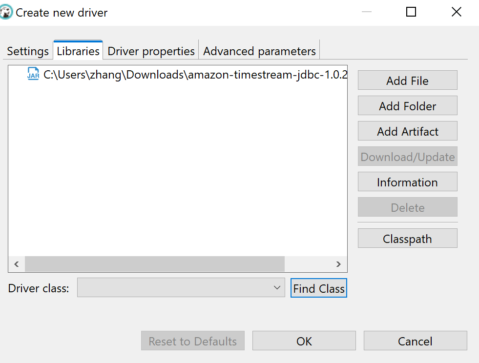
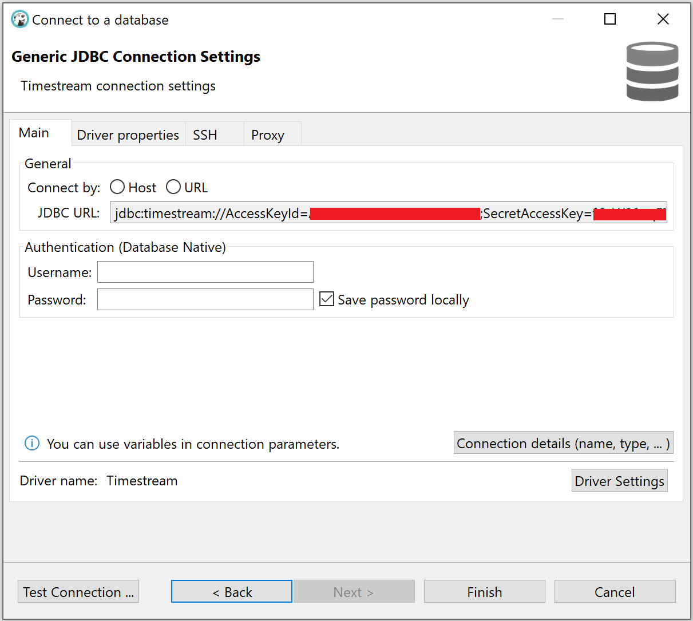
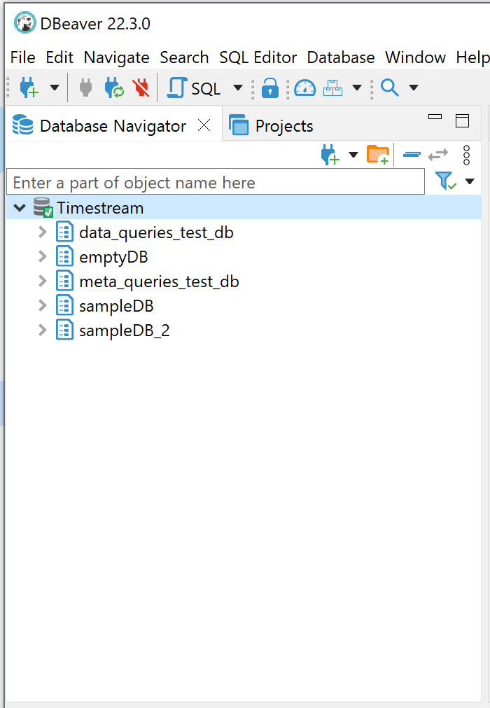

### DBeaver 
[Link to product webpage](https://dbeaver.io/download/).

#### Adding the Amazon Timestream JDBC Driver
1. [Download](https://github.com/awslabs/amazon-timestream-driver-jdbc/releases/latest) the Timestream JDBC driver shaded JAR file (e.g., `amazon-timestream-jdbc-<version>-shaded.jar`)

2. Launch the DBeaver application.

3. In the main menu, navigate to and select **Database > Driver Manager > New**.

    a. In **Settings** tab, for **Driver Name** field, enter a descriptive name (e.g. `Timestream`)

    b. In **Settings** tab, for **URL Template** field, enter your JDBC connection string. For example:

    ```
        -- replace the values in "<>" with your own value
        jdbc:timestream://AccessKeyId=<myAccessKeyId>;SecretAccessKey=<mySecretAccessKey>;SessionToken=<mySessionToken>;Region=<myRegion>
    ```

    

      For a list of connection properties, see [README](../../README.md#optional-connection-properties).

    c. In **Libraries** tab, click Add file and navigate and select your Amazon Timestream JDBC driver JAR file.

    d. In **Libraries** tab, after adding the JAR file, click **Find Class**. There maybe nothing listed in the **Driver class:**. If that is the case, ignore it and continue the next step. 

    

    e. In **Settings** tab, the field Class Name should be automatically filled in. If not, enter the **Class Name:** ```software.amazon.timestream.jdbc.TimestreamDriver```. Click **Ok**.

#### Connecting to Amazon Timestream Using DBeaver
1. In the main menu, navigate to and select **Database > New Database Connection**.
    
2. Select your database/driver created above identified by Driver Name you chose. 

    

3. After you see the popup window as below, click **Test Connection ...** to confirm your connection to Timestream.

    

4. Click **Finish**. After you succeed to connect to Timestream, click the driver name on the left window. Then you will be able to see the all the database listed as the example.

    