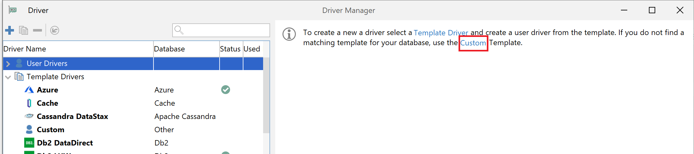
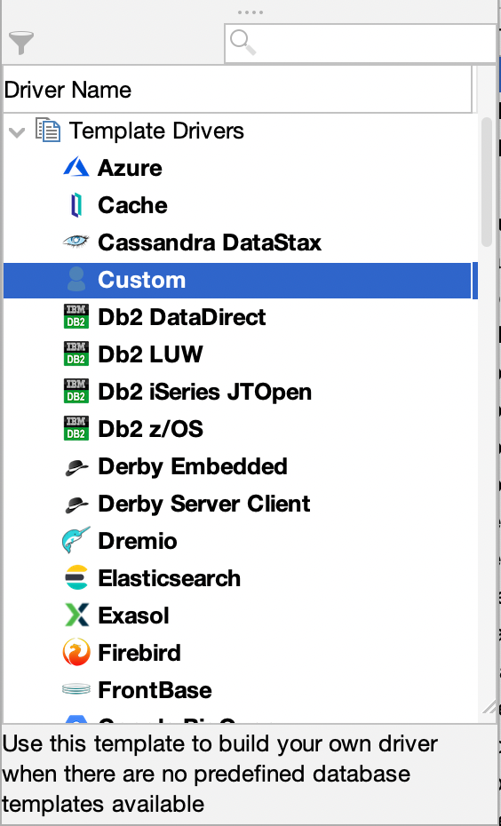
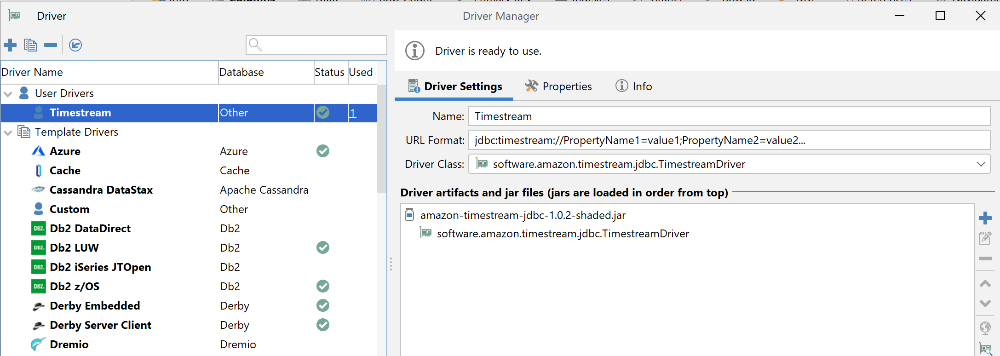
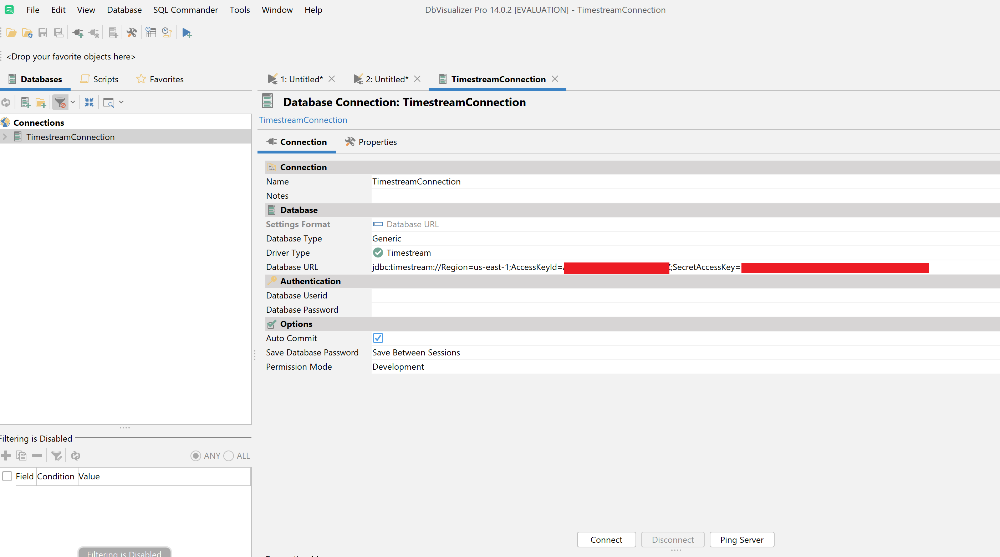
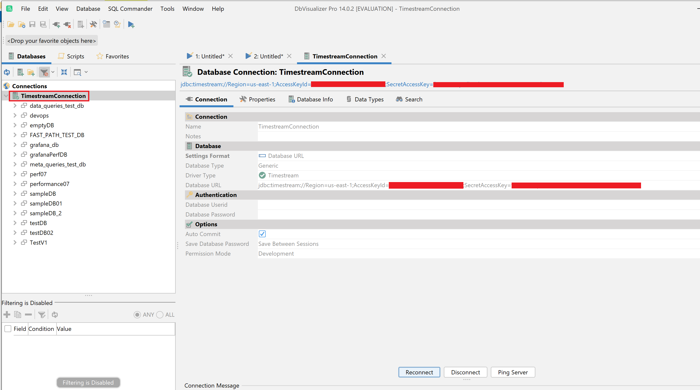

### DbVisualizer 
[Link to product webpage](https://www.dbvis.com/download/).

#### Adding the Amazon Timestream JDBC Driver
1. [Download](https://github.com/awslabs/amazon-timestream-driver-jdbc/releases/latest) the Timestream JDBC driver shaded JAR file (e.g., `amazon-timestream-jdbc-<version>-shaded.jar`)
2. Start the DbVisualizer application and navigate to the menu path: **Tools > Driver Manager...**. In the popped up window, click the "Custom" link on the right side. Or find the **Custom** row on the left side and click it.

    

    

3. In the new popup window, find **Driver Settings** tab and fill the following info.

    a. For the **Name:** field, enter **Timestream**

    b. For the **URL Format:** field, enter ```jdbc:timestream://PropertyName1=value1;PropertyName2=value2...```. For a list of connection properties, see [README](../../README.md#optional-connection-properties).

    c. Click the **+** on the right side to select the Timestream JDBC JAR file.

    d. Ensure the ```software.amazon.timestream.jdbc.TimestreamDriver``` is selected in the **Driver Class:** field. Your Driver Manager settings for **Timestream** should look like the following image.

    

    e. Close the dialog. Now the Timestream JDBC driver is added and ready to use.

4. Connecting to Amazon Timestream Using DbVisualizer

    a. Navigate the menu path **Database > Create Database Connection**

    b. For the **Name** field, enter a descriptive name for the connection, for example ```TimestreamConnection```

    c. For the **Driver Type** field, ensure the **Timesteam** is selected.

    d. For the **Database URL** field, enter your [JDBC connection string](../../README.md#optional-connection-properties). For example, ```jdbc:timestream://AccessKeyId=abcdef;SecretAccessKey=123456;SessionToken=xofdgdmlwj;Region=us-east-1;```

    e. Your **Database Connection** dialog should look like the following.

    

    h. Click **Connect** button to connect to Timestream. Then you could connect to the Timestream database. You should be able to see all databases on the left side under the connection name as the example below.

     

#### Known Limitations
1. Unicode string may not be displayed correctly in DbVisualizer. It is not caused by JDBC driver, it is DbVisualizer unicode display limitation.
