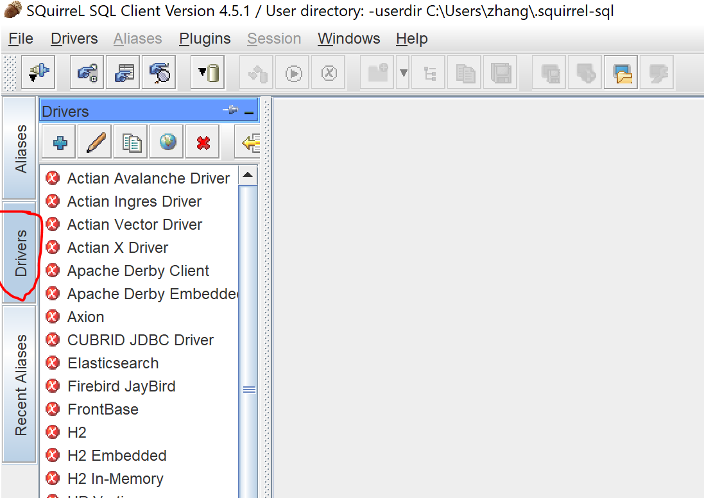
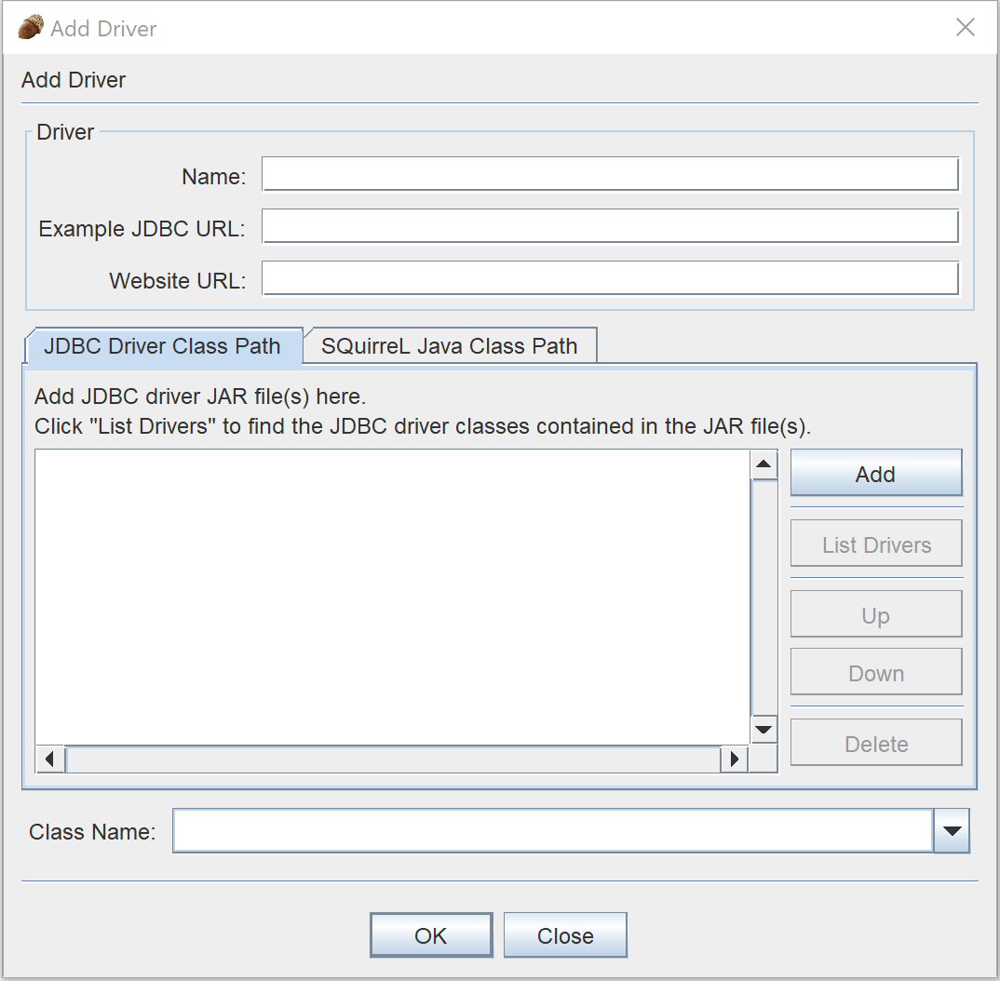
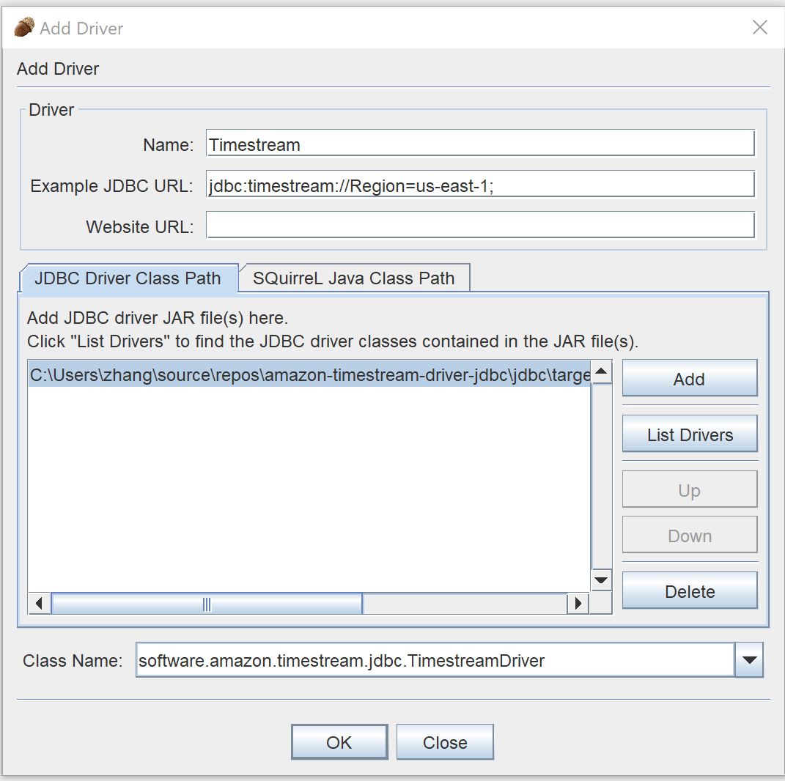
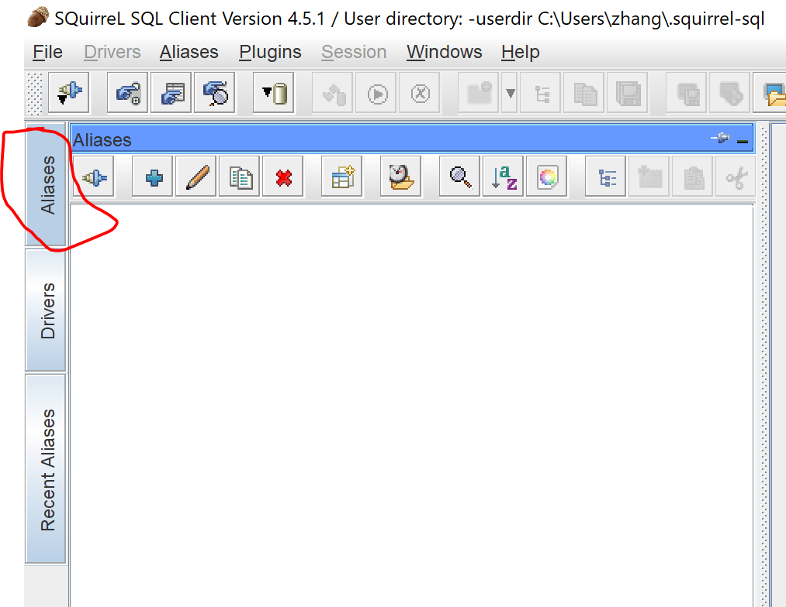
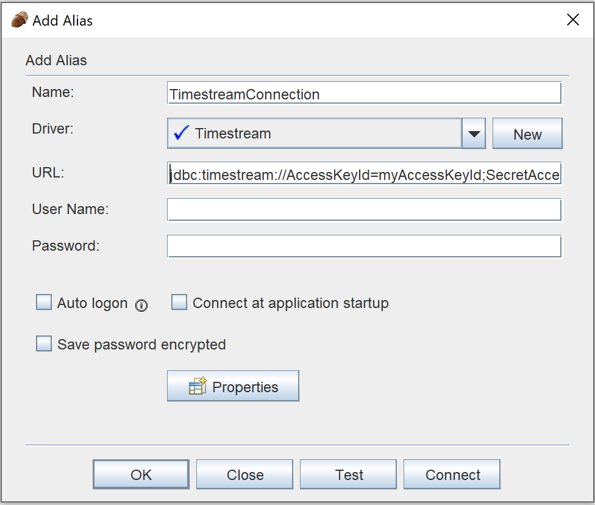
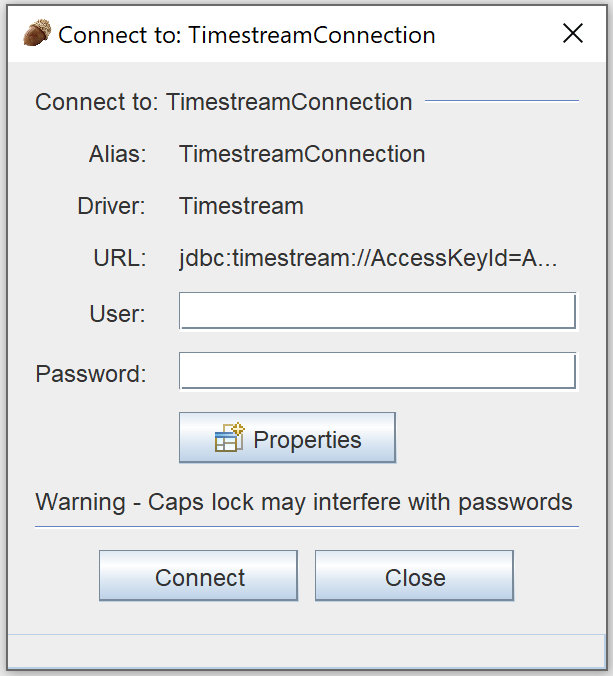
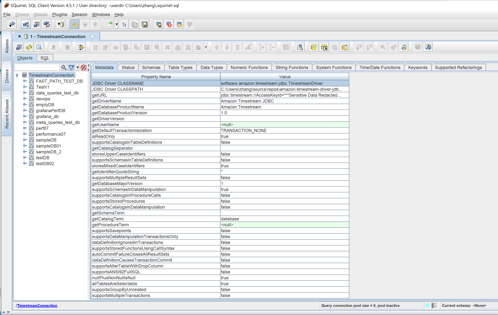

### SQuirreL SQL Client 
[Link to product webpage](https://sourceforge.net/projects/squirrel-sql/).

#### Adding the Amazon Timestream JDBC Driver
1. [Download](https://github.com/awslabs/amazon-timestream-driver-jdbc/releases/latest) the Timestream JDBC driver shaded JAR file (e.g., `amazon-timestream-jdbc-<version>-shaded.jar`)
2. Launch the SQuirreL SQL Client application.
3. Ensure the **Drivers** tab is selected.

    

4. Navigate to menu path **Drivers > New Driver ...**

    

5. For the **Name:** field, enter **Timestream**.
6. For the **Example JDBC URL:** field, enter `jdbc:timestream://AccessKeyId=<myAccessKeyId>;SecretAccessKey=<mySecretAccessKey>;SessionToken=<mySessionToken>;Region=<myRegion>;`
7. Select the **JDBC Driver Class Path** tab.
8. Click the **Add** button and navigate to the downloaded Amazon Timestream JDBC driver JAR file.
9. Click **OK** to add the JAR file to the **JDBC Driver Class Path**.
10. Click the **List Drivers** button.
11. For the **Class Name:** field, ensure the `software.amazon.timestream.jdbc.TimestreamDriver` is selected.

    

12. Click the **OK** button to create and save the driver settings.

#### Connecting to Amazon Timestream Using SQuirreL SQL Client

1. Launch the SQuirreL SQL Client application.
2. Ensure the **Aliases** tab is selected.

    

3. Navigate the menu path **Aliases > New Alias...**
4. In the popup window, fill the following info

    a. For the **Name:** field, enter a name for this alias. For example, `TimestreamConnection`
    
    b. For the **Driver:** field, ensure **Timestream** is selected.

    c. For the **URL:** field, enter your JDBC connection string. For example, `jdbc:timestream://AccessKeyId=myAccessKeyId;SecretAccessKey=mySecretAccessKey;SessionToken=oxcdsfsnu;Region=us-east-1;`. For a list of connection properties (e.g., Access Key, Secret Key, etc.), see [README](../../README.md#optional-connection-properties)

    d. Do **NOT** use the **"User Name:"** and **"Password:"** fields to fill credentials, they could not work.

    

5. Click **OK** to save the alias.
6. Double-click your alias to start the connection dialog.
7. Click the **Connect** button to connect.

    

8. After you succeed to connect to Timestream, you will be able to see a window like the below example.

    

